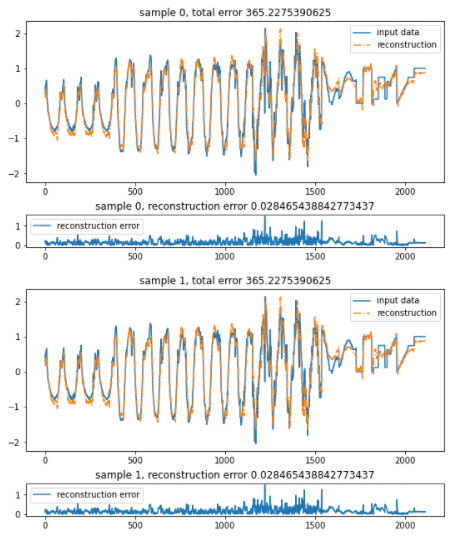

# Anomaly-Detection-using-Autoencoders

This project is about predicting the anomalies the from sensor outputs in a 24 hour window. The goal was to provide a count of the number of sensors that went off
in a particular day. This was detected based on the loss values that went beyond the defined threshold.

The dataset consisted of multiple .npy files covering NConservatory and SConservatory from the amazon Seattle domes.

(I will not be uploading the dataset due to competition rules)

To detect anomalies I used autoencoders in PyTorch. Using the the reconstruction error and the no. of values that went beyond the threshold the anomalies were detected.

Formula: X_test_predicted - X_test > Reconstruction error threshold

Obtained a over all reconstruction error of 0.028

